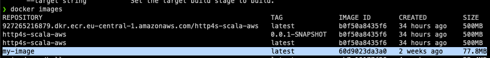

# Docker
Docker bir container(konteynır) yonetim servisidir. Docker'in temel amaci gelistirme, nakletme ve calistirmaktir. Amac gelistirilen uygulamanin konteynir icinde tasinarak herhangi bir ortamda calistiralabilmesidir. 
* Gelistirme yaparken isletim sistemi bagimliligini en aza indirmek
* Containerler sayesinde takim uyelerinin farkli birimlerde calismasini kolaylastirmak
* Containerler fiziksel, sanal ve bulut ortamlarina kolayca deploy edilebilir.
* Uygulamalarin scale edilmesini kolaylaştirir.

### IMAGE
Docker'da herşeyin temeli image'lardir. Image'lar docker ortaminda calisan read-only şablonlardir. Herkese acik olarak paylasabilecegimiz veya onceden yapilandirilmiş sunucu ortamlarini paketlemek icin uygun bir yol sağlar.

Bir image'i calistirmak icin `docker run [IMAGE_NAME]` komutunu kullanabiliriz.

Örnek olarak hazir bir sunucunun image'ini nasil kullanacagimizi inceleyelim.

`docker run -p 8080:80 -d nginxdemos/hello`

Bu komutu calistirdigimizda ilk olarak bilgisayaramizda daha once bir nginxdemos/hello image'i var mi diye bakacak. Eger image daha once yuklenmemisse image'i indirecek ve daha sonra indirdigi bu image'i calistiracaktir.

nginxdemos/hello demo icin hazir olan image'dır.
`-p 8080:80` ve `-d` komutlari kontainers bolumunda daha detayli olarak islenecektir.


#### Docker image'larin Listelenmesi
`docker images`

Bu komut ile az once indirdigimiz image'i gorebilir ve istersek `run` komutu ile tekrar tekrar kullanabiliriz.


Resimde de gordugumuz gibi her image bazi niteliklere sahiptir.
`TAG`: Image'lari mantiksal olarak etiketlemek icin kullanilir.
`IMAGE ID`: Image'larin eşsiz olarak tanimlanasi icin kullanilir.
`CREATED`: Image'in ne kadar zaman once olusturuldugunu gosterir.
`VIRTUAL SIZE`: Image'in boyutu.

#### Docker Image'larin Silinmesi
Silmek istedigimiz image'i `rmi` komutu kullanarak silebiliz.
`docker rmi [IMAGE_ID]`


Orneklere devam edebilmek icin `docker run -p 8080:80 -d nginxdemos/hello` ile az once sildigimiz image'i tekrar calıştırabilirsiniz.

#### Docker Image Parametreleri
docker images ile diger parametreler şu sekildedir.
`-q`: Sadece image id'lerini doner. `docker image -q`
`inspect`: Image'in detayli bilgisini doner. `docker inspect ubuntu`

### Containers
Container Docker image'inin calisan bir instance'idir. Docker'in temel amaci container'ları çalıştırmaktır.

`docker run ubuntu` komutunu calistirdigimizda ubuntu image'ini indirecegini ve calistiracagini soylemistik. Aslinda image'in bu calisan hali bir container'dir.

Bir image'i indirmek ve calistirmak icin aşağıdaki komutu kullanmıştık.
`docker run -p 8080:80 -d nginxdemos/hello`

Bu komut aslinda nginxdemos/hello image'ini indirmek ve calistirmak 

#### Container'larin Listelenmesi
Çalışan Container'ları `ps` komutu ile listeleyebiliriz.


Bir image'i indirmek ve calistirmak icin aşağıdaki komutu kullanmıştık.
`docker run -p 8080:80 -d nginxdemos/hello`

Bu komut aslinda nginxdemos/hello image'ini yoksa indirip calistirmak varsa olan image'i calistirmak icin kullandik. nginxdemos/hello 80 portu ile calisan bir sunucu image'idir. Biz `-p 8080:80` parametresi ile icerde 80 olan portu kendi bilgisayaramizin 8080 portuna baglamis olduk. Bu parametre ile bizim 8080 portumuzu ngnixdemo/hello containerinin icindeki 80 portuna baglamiş olduk. Ve `-d` parametresi ile bu container'in arka tarafta calismasini ve output olarakta container id'sini vermesini istemiş olduk.

Yukarida ki resimde de gordugumuz gibi her container bazi niteliklere sahiptir.
`CONTAINER ID`: Container'larin eşsiz olarak tanimlanmasi icin kullanilir.
`IMAGE`: Container oluşurken hangi image ile oluştugunu gosterir.
`COMMAND`: Docker image'inda belirtilmis olan ve bu container'in calişmasini sağlayan komut. Bu komut durursa container'da durur.
`CREATED`: Container'in ne kadar zaman once olusturuldugunu gosterir.
`STATUS`: Kontainer'in o zamanki durumunu ve ne kadar zamandır o durumda oldugunu gösterir.
`PORTS`: Container'in port bilgisini gosterir. Ornek port **0.0.0.0:8080 -> 80/tcp** şeklindedir. **0.0.0.0** kısmı host kısmıdır. Host arayuzunun IPV4 adresidir. **0.0.0.0** ozel bir adrestir ve **bütün host arayuzleri**  anlamina gelir. **8080** parçası bizim bilgisayarimizdaki bu container'a gitmek icin kullanmamiz gereken port'u gostermektedir. **80/tcp** ise 8080 portunun container icindeki hangi port'a baglandigini gostermektedir.
`NAMES`: Burasi da container'in ismini gostermektedir. Eger isim docker run komutunda parametre ile verilmezse rastgele bir isim verilmektedir.

`-a` parametresi ile butun(çalışan ve durmuş) container'lar listelenir.


#### Docker Container Komutlari
Burada container'lar benzersiz id alacagi icin id yerine CONTAINER_ID kullanacagim. Kendi container id'niz ile degistirip deneyebilirsiniz.

`docker top CONTAINER_ID`: Bu komut ile container icindeki islemleri gorunteleyebiliriz.
`docker stop CONTAINER_ID`: Çalişan bir container'i durdurmak icin kullanilir.
`docker rm CONTAINER_ID`: Durmuş bir container'ı silmek için kullanılır.
`docker stats CONTAINER_ID`: Çalışan bir container icindeki istatistikleri gösterir.
`docker pause CONTAINER_ID`: Çalışan bir container'ı askiya almak icin kullanilir.
`docker unpause CONTAINER_ID`: Askıya alınmış bir container'i devam ettirmek icin kullanilir.
`docker kill CONTAINER_ID`: Stop komutu guvenli bir sekilde container'i durdururken kill komutu container'i calişiyor halde tutan komutu aniden sonlandırır. 

#### Container Yaşam Döngüsü


#### Kullanışlı Docker Komutlari
`docker logs CONTAINER_ID`: Container'in icinde ki loglari gormeye yarar.
`docker exec -it CONTAINER_ID /bin/bash`: Container'in içine girerek komut satırını kullanmamızı sağlar.

## DOCKERFILE
Eger buraya kadar sabırla okuduysanız eee bunlar hep hazir image'lar kendi image'imi nasil olusturabilirim dedidiginizi duyar gibiyim. Işte tam olarak burada hayatimiza Dockerfile girmekte.
Simdiye kadar orneklerimizde nginxdemo/hello image'ini kullandık. Bu nginx'in hazirlayip docker hub'a koymus olduğu bir image. Buradan sonra kendi image'imizi olusturmayi deneyecegiz.

Ilk olarak `Dockerfile` adinda uzantisi olmayan bir file olusturalim.
Daha sonra icine aşağıdaki kod parcasini kopyalayalim.
```
FROM ubuntu

CMD ["echo","'hello'"]
```
`FROM ubuntu` ile icinde ubuntu işletim sistemi olan bir image'i kullanmak istediğimizi belirtmiş oluyoruz.
`CMD ["echo","'hello'"]` komutu ile de bu işletim sisteminde caliştirmak istediğimiz komutu yaziyoruz.

Dosyayi kaydettikten sonra image'imizi olusturmaya hazırız artık. Bundan sonraki işlem icin `build` komutunu kullanacağız.
Komut satırından Dockerfile olusturdugumuz dizine gittikten sonra aşağıdaki komutu calıştırabiliriz.

`docker build -t my-image:latest .` 

`-t my-image:latest`: -t parametresini image'a isim ve etiket vermek icin kullanırız.
`.`: docker build komutunun son parametresi docker file'in bulunduğu dizini veya url'i vermemiz gerekiz. Biz burada `.` su anda komut satırında bulunduğum komut demiş olduk.

Bu komuttan sonra `docker images` diyerek oluşturduğumuz image'ı görebiliriz.



Simdi docker run diyerek olusturdugumuz image'i çalıştırabiliriz.
`docker run my-image`

Simdi de olusturdugumuz container'i `docker ps -a` ile inceleyelim.


Gördüğünüz gibi container'ımız oluşmuş ve status'u exited. Bunun sebebi yazmış olduğumuz Dockerfile'in icindeki CMD komutunda calışıp biten bir komut yazmış olmamiz. 

Daha sonra istersek `docker push` komutunu kullanarak image'imizi tüm insanlığın kullanımına açabiliriz :)

Ilerleyen zamanlarda docker network ve docker compose konularina da yer vermek istiyorum.

Simdilik anlatacaklarım bu kadar. Umarım sizi sıkmadan buraya kadar okumanıza vesile olabilmişimdir.
